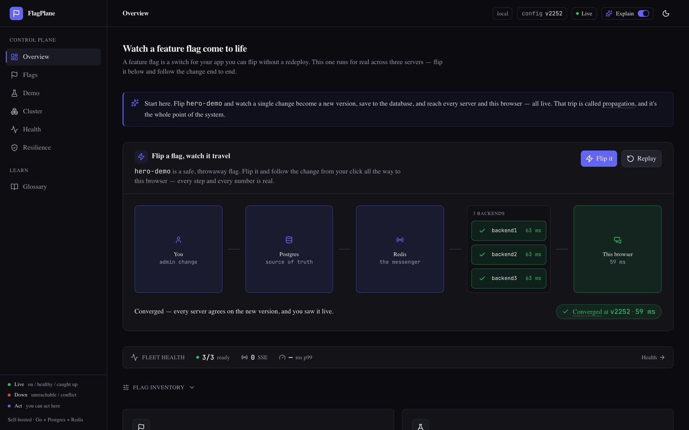
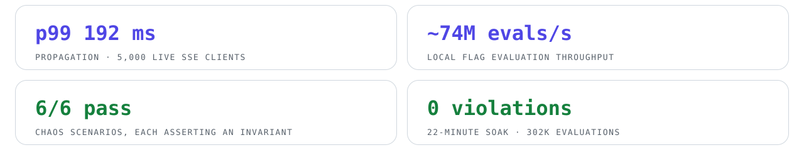
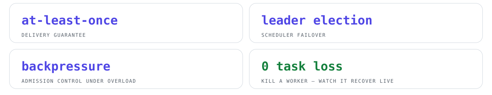

<picture>
  <source media="(prefers-color-scheme: dark)" srcset="assets/hero-dark.svg">
  
</picture>

## Flagship work

### [feature-flag-system](https://github.com/kripa-sindhu-007/feature-flag-system) — a feature-flag platform proven under failure

<picture>
  <source media="(prefers-color-scheme: dark)" srcset="assets/metrics-ff-dark.svg">
  
</picture>

Self-hosted flags with percentage rollouts, real-time SSE propagation, and local-eval SDKs (TypeScript + Go) — running as a **3-node cluster behind nginx** with Prometheus, Grafana, and OpenTelemetry. Versioned config with optimistic concurrency, a durable event log, and gap-detect + reconcile clients. The dashboard above shows a real flip reaching every server and the browser, live. Every number is measured, every guarantee is chaos-tested, every limitation is documented → [BENCHMARKS](https://github.com/kripa-sindhu-007/feature-flag-system/blob/main/docs/BENCHMARKS.md) · [CHAOS](https://github.com/kripa-sindhu-007/feature-flag-system/blob/main/docs/CHAOS.md) · [LIMITATIONS](https://github.com/kripa-sindhu-007/feature-flag-system/blob/main/docs/LIMITATIONS.md)

`Go` `PostgreSQL` `Redis` `Next.js` `nginx` `Prometheus` `Grafana` `OpenTelemetry`

 

### [task-queue-educational-dashboard](https://github.com/kripa-sindhu-007/task-queue-educational-dashboard) — a distributed task queue you can *see*

<picture>
  <source media="(prefers-color-scheme: dark)" srcset="assets/metrics-tq-dark.svg">
  
</picture>

A live dashboard that visualizes every stage of a distributed queue — enqueue, lease, process, retry, dead-letter. Kill a worker (or the leader) and watch the system recover with **zero task loss**, in real time, on full Prometheus/Grafana observability.

`Go` `Redis` `Next.js` `Docker` `GitHub Actions`

## At work — BeatRoute · Software Engineer · May 2025 – present

- Ship production SaaS frontends used by field teams across **15+ countries** (Angular, TypeScript)
- Led the **Angular 14 → 19 migration** of two production apps — zero downtime, full backward compatibility
- Co-built the internal **UI component library** adopted across teams (**~30 % less** feature dev effort)
- Architected the **Report Builder** frontend (flagship feature) and a Jasmine/Karma test framework with **90 %+ coverage**

## Beyond code

- 📄 **Published researcher** — co-author of *EV-GREEN*, [**Computing** (Springer Nature), Vol. 108, Feb 2026](https://github.com/kripa-sindhu-007/ev-routing-green-v2g) — EV eco-routing via hybrid MILP + graph heuristics
- 🏅 **GATE CSE — top 5 % nationwide**, twice (2024 & 2025)
- ⚔️ **LeetCode Knight** — peak rating 1914, 1000+ problems solved
- 🎓 B.Tech CSE, **IIIT Guwahati** (2021 – 2025)

## Stack

  

<picture>
  <source media="(prefers-color-scheme: dark)" srcset="https://github-readme-stats.vercel.app/api?username=kripa-sindhu-007&show_icons=true&hide_border=true&bg_color=00000000&title_color=818cf8&icon_color=818cf8&text_color=c9d1d9">
  
</picture>

**Building systems that scale — and proving it.**
Reach me at [sindhukripa007@gmail.com](mailto:sindhukripa007@gmail.com)

